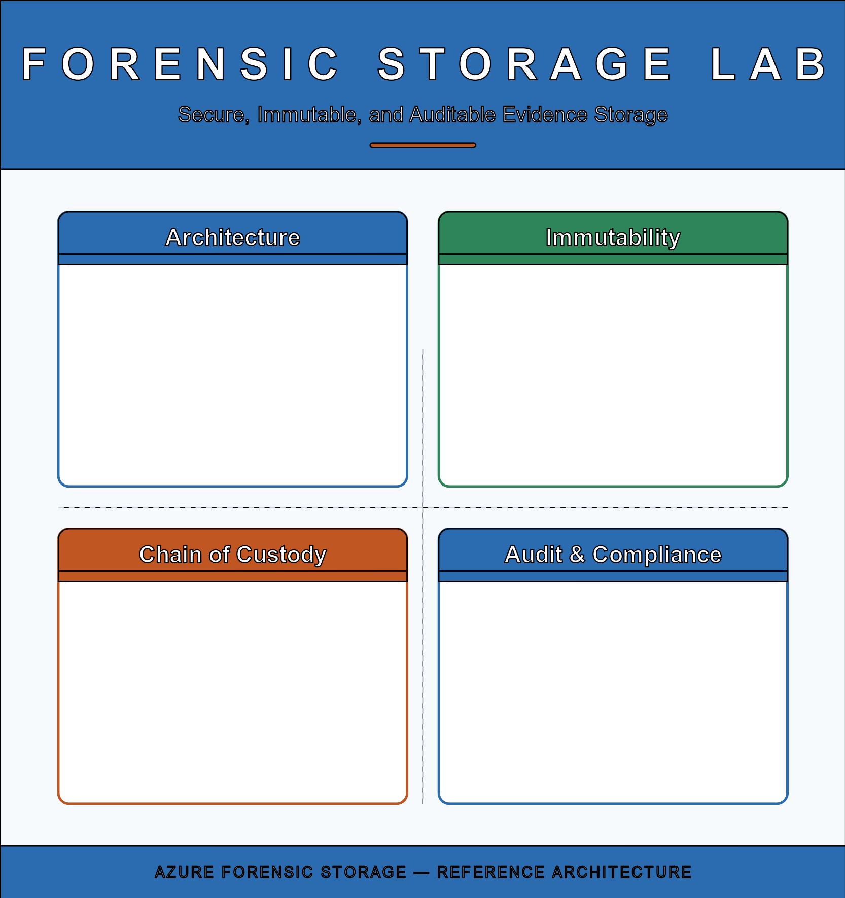
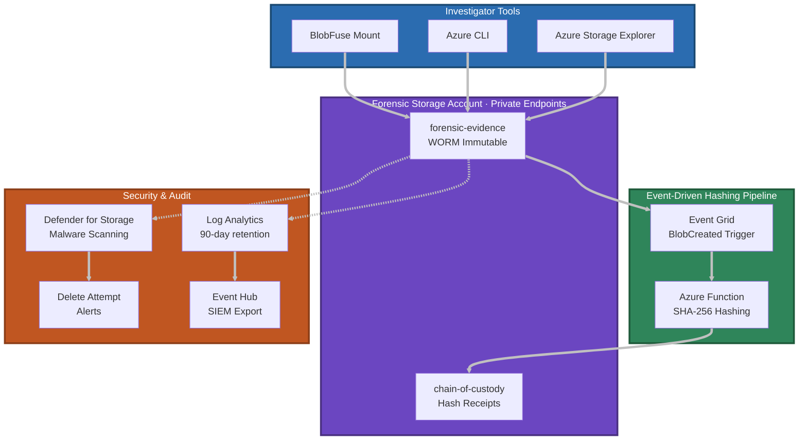
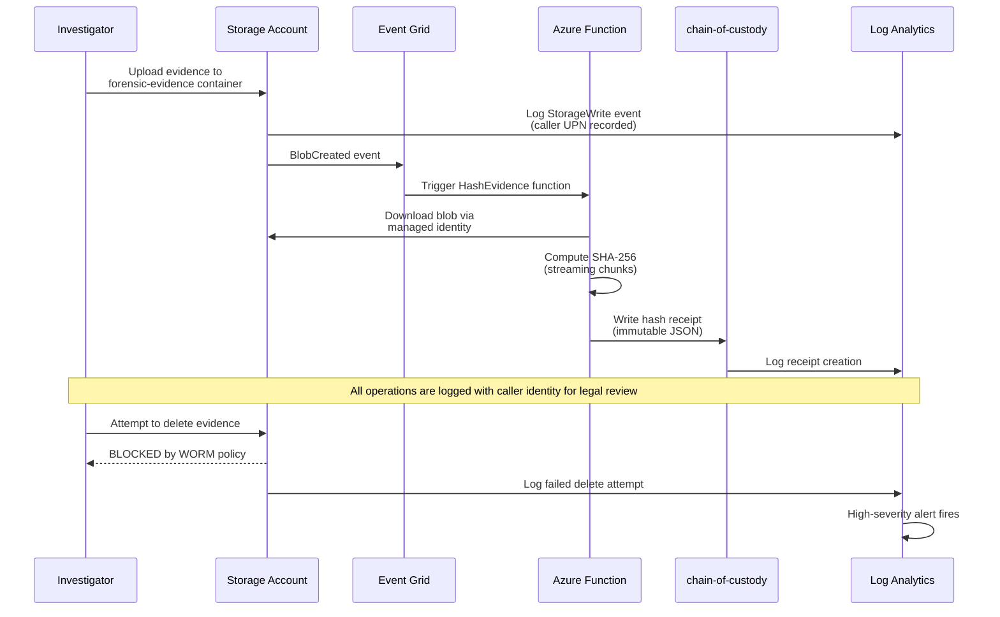
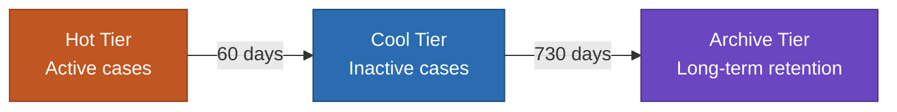
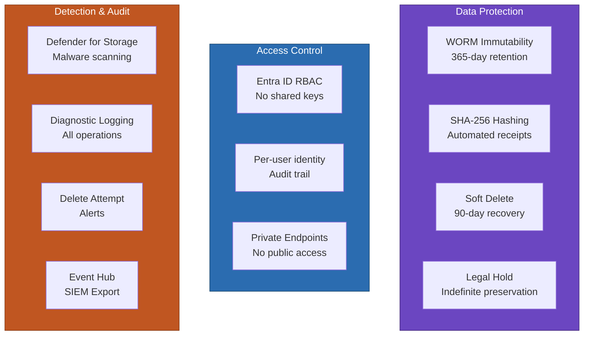

# Forensic Storage Lab
An Azure-based forensic evidence storage and chain-of-custody system that demonstrates how cloud infrastructure can meet digital forensics requirements for **immutability**, **auditability**, **legal defensibility**, and **retention compliance** -- without changing investigator workflows.



[View the SVG version](docs/media/infographic.svg)

---

## Architecture Overview



## Chain-of-Custody Flow



## Lifecycle Tiering



Automatic tiering reduces storage costs without affecting immutability. Rules apply to the `forensic-evidence` container only; chain-of-custody receipts remain in the hot tier for frequent access.

---

## Prerequisites

- Azure subscription with **Owner** or **Contributor** role
- [Azure CLI](https://learn.microsoft.com/en-us/cli/azure/install-azure-cli) v2.50+
- [Bicep CLI](https://learn.microsoft.com/en-us/azure/azure-resource-manager/bicep/install) (bundled with Azure CLI)
- PowerShell 7+ (for deployment scripts)
- **Python 3.11** (must match the Function App runtime — see below)
- Investigator Entra ID object IDs (for RBAC assignment)

### Python Virtual Environment

The Azure Function targets **Python 3.11**. If your system Python is a different version, create a venv to avoid `ModuleNotFound` errors during deployment:

```powershell
# Windows (py launcher)
py -3.11 -m venv .venv
.\.venv\Scripts\Activate.ps1

# Verify
python --version   # Should show Python 3.11.x
```

Activate this venv before running `deploy.ps1` or `func azure functionapp publish`.

## Quick Start

### 1. Configure Parameters

Edit `infra/main.bicepparam` with your investigator principal IDs:

```bicep
param investigatorPrincipalIds = [
  '<your-entra-id-object-id>'
]
```

### 2. Deploy Infrastructure

```powershell
az login
az account set --subscription "<subscription-id>"

.\scripts\deploy.ps1
```

### 3. Validate Deployment

```powershell
.\scripts\validate-demo.ps1 `
  -StorageAccountName "<storage-account-name>" `
  -ResourceGroup "rg-forensic-storage-lab-v2" `
  -WorkspaceId "<log-analytics-workspace-id>"
```

### 4. Upload Evidence

```bash
az storage blob upload \
  --account-name <storage-account-name> \
  --container-name forensic-evidence \
  --name "case-2024-001/image.e01" \
  --file ./image.e01 \
  --auth-mode login
```

### 5. Verify Integrity

```powershell
.\scripts\verify-integrity.ps1 `
  -StorageAccountName "<storage-account-name>" `
  -BlobName "case-2024-001/image.e01"
```

---

## Security Controls

This lab is designed to deploy in **[Secure Future Initiative (SFI)](https://www.microsoft.com/en-us/security/blog/2024/05/03/security-above-all-else-expanding-microsofts-secure-future-initiative/)**-aligned environments. All resources follow SFI principles: shared key access is disabled on every storage account, all authentication uses Entra ID with managed identities, and the deployment pipeline avoids connection strings entirely. [Learn more about SFI →](https://aka.ms/secuefutureinitiative)



| Control | Implementation | Purpose |
|---------|----------------|---------|
| Immutability | Container-level WORM (time-based retention) | Prevents deletion/tampering of evidence |
| Chain of Custody | Automated SHA-256 hash receipts | Cryptographic proof of integrity |
| Legal Hold | Per-container litigation tags | Indefinite preservation override |
| Access Control | Entra ID RBAC, shared keys disabled | Identity-based accountability |
| Malware Scanning | Defender for Storage (5 TB/mo cap) | Detect malicious uploads |
| Audit Logging | Log Analytics, 90-day retention | Full operation history |
| Alerting | High-severity delete attempt alerts | Real-time incident notification |
| SIEM Export | Event Hub integration (optional) | Stream to Splunk, Sentinel, etc. |

---

## Project Structure

```
lab-forensic-storage/
├── infra/                              # Infrastructure as Code (Bicep)
│   ├── main.bicep                      # Root template (subscription scope)
│   ├── main.bicepparam                 # Deployment parameters
│   └── modules/
│       ├── storage-account.bicep       # Storage — ADLS Gen2 with HNS
│       ├── containers.bicep            # Storage — evidence & chain-of-custody
│       ├── lifecycle.bicep             # Storage — Hot -> Cool -> Archive tiering
│       ├── rbac.bicep                  # Security — investigator role assignments
│       ├── monitoring.bicep            # Security — Log Analytics, Defender, alerts
│       ├── diagnostics.bicep           # Security — diagnostic settings
│       ├── siem-export.bicep           # Security — optional Event Hub for SIEM
│       ├── function-app.bicep          # Workflow — Azure Function (Python, EP1)
│       ├── event-grid.bicep            # Workflow — BlobCreated event subscription
│       ├── networking.bicep            # Security — VNet and private endpoint subnets
│       ├── private-endpoint.bicep      # Security — blob + dfs private endpoints
│       └── private-dns.bicep           # Security — private DNS zones
├── functions/
│   └── hash-evidence/
│       ├── function_app.py             # SHA-256 hashing function
│       ├── host.json                   # Function runtime config
│       └── requirements.txt            # Python dependencies
├── scripts/
│   ├── deploy.ps1                      # Deployment orchestration
│   ├── validate-demo.ps1               # End-to-end validation (7 acts)
│   ├── verify-integrity.ps1            # Evidence integrity checker
│   ├── generate-download-url.ps1       # Shareable blob download URL generator
│   ├── mount-evidence-drive.ps1        # Map containers as Windows drives (rclone + WinFsp)
│   └── dismount-evidence-drive.ps1     # Cleanly unmount mapped drives
├── docs/
│   ├── lab-walkthrough.md              # Step-by-step demo guide
│   ├── lab-vs-production.md            # Lab vs production differences
│   ├── storage-explorer-setup.md       # Entra ID auth + navigation
│   ├── drive-mapping-setup.md          # Map storage as Windows drives (rclone + WinFsp)
│   ├── legal-hold-commands.md          # Legal hold CLI reference
│   └── blob-download-url-sharing.md    # User Delegation SAS download URLs
└── goals.md                            # Project goals & success criteria
```

---

## Configuration Reference

| Parameter | Default | Description |
|-----------|---------|-------------|
| `location` | `eastus2` | Azure region |
| `retentionDays` | `365` | WORM immutability retention period |
| `hotToCoolDays` | `60` | Days before tiering to Cool |
| `coolToArchiveDays` | `730` | Days before tiering to Archive |
| `blobSoftDeleteRetentionDays` | `90` | Soft delete recovery window |
| `containerSoftDeleteRetentionDays` | `90` | Container soft delete window |
| `enableSiemExport` | `false` | Enable Event Hub for SIEM integration |
| `investigatorPrincipalIds` | `[]` | Entra ID object IDs for RBAC |
| `principalType` | `User` | `User`, `Group`, or `ServicePrincipal` |

---

## Lab vs Production

| Aspect | Lab | Production |
|--------|-----|------------|
| Immutability | Container-level WORM (unlocked) | Version-level VLWI (locked) |
| Retention | 7 days (configurable) | 365+ days |
| Redundancy | LRS (single region) | GRS/RAGRS (geo-replicated) |
| Legal Holds | Not used in demo | Required for litigation |
| RBAC | Individual user principals | Entra ID groups + PIM |
| SIEM Export | Disabled | Event Hub to Sentinel/Splunk |

See [docs/lab-vs-production.md](docs/lab-vs-production.md) for full details.

---

## Demo Walkthrough

The validation script (`scripts/validate-demo.ps1`) covers a 7-act demonstration:

| Act | Title | What It Proves |
|-----|-------|---------------|
| Preflight | Environment Check | Azure CLI auth, resource group |
| 1 | The Vault | Storage security: Entra ID only, WORM immutability, Defender |
| 2 | The Upload | Evidence ingestion via CLI with RBAC |
| 3 | The Hash | Automated chain-of-custody receipt generation |
| 4 | The Lock | Immutability enforcement (delete/overwrite blocked) |
| 5 | The Audit | KQL queries: operation summary, failed deletes, caller identity |
| 6 | The Retrieve | Download + SHA-256 integrity verification |
| 7 | The Lifecycle | Tiering rules (Hot -> Cool -> Archive) |

See [docs/lab-walkthrough.md](docs/lab-walkthrough.md) for the full guided walkthrough.

---

## Additional Documentation

- [Lab Walkthrough](docs/lab-walkthrough.md) -- 30-45 minute step-by-step demo
- [Lab vs Production](docs/lab-vs-production.md) -- deployment trade-offs and hardening guidance
- [Storage Explorer Setup](docs/storage-explorer-setup.md) -- Entra ID authentication and folder navigation
- [Drive Mapping Setup](docs/drive-mapping-setup.md) -- map containers as Windows drives via rclone + WinFsp (optional convenience path)
- [Legal Hold Commands](docs/legal-hold-commands.md) -- applying and releasing litigation holds
- [Blob Download URL Sharing](docs/blob-download-url-sharing.md) -- generate time-limited download URLs using User Delegation SAS

---

## Legal Hold (Quick Reference)

```bash
# Apply a legal hold
az storage container legal-hold set \
  --account-name <storage-account-name> \
  --container-name forensic-evidence \
  --tags "case-2024-001" \
  --auth-mode login

# Release a legal hold
az storage container legal-hold clear \
  --account-name <storage-account-name> \
  --container-name forensic-evidence \
  --tags "case-2024-001" \
  --auth-mode login
```

Legal holds override time-based retention and persist until explicitly released.

---

## License

This project is provided as a reference architecture for educational and lab purposes.
