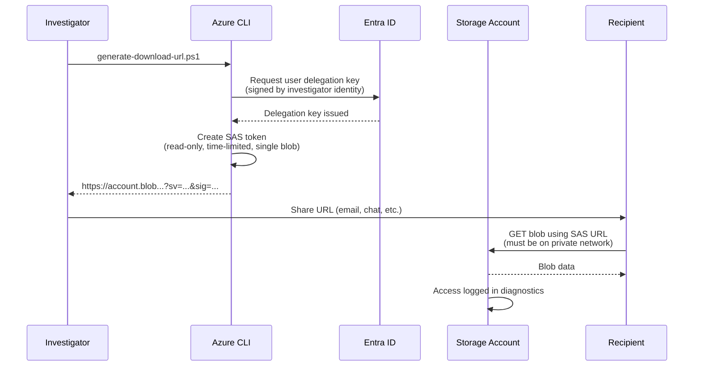
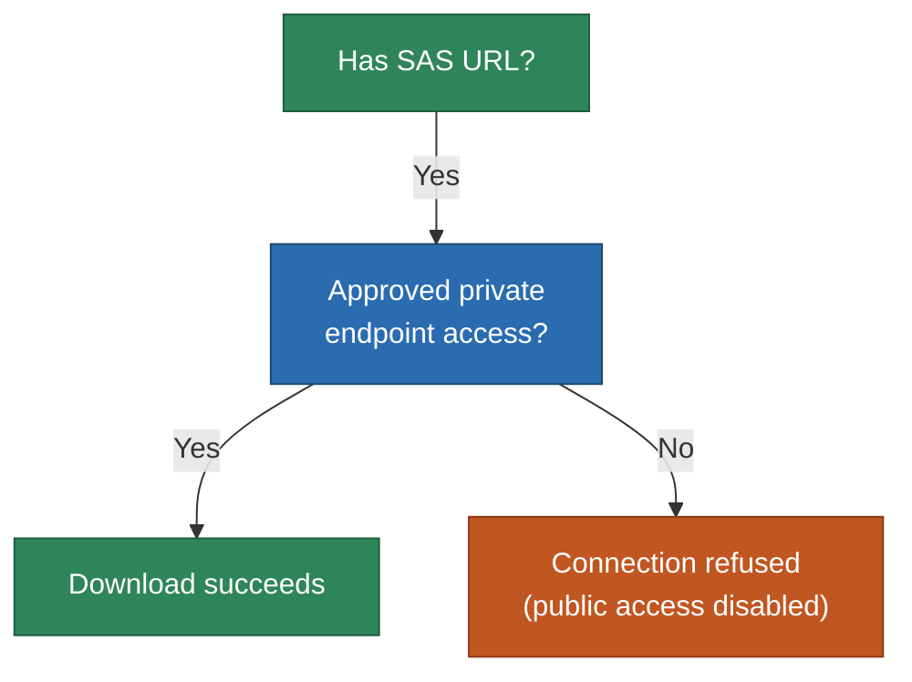

# Blob Download URL Sharing

Share time-limited, read-only download URLs for evidence blobs with other investigators or authorized personnel using User Delegation SAS.

## How It Works



### Why User Delegation SAS?

This storage account has **shared key access disabled** -- only Entra ID authentication is allowed. Standard SAS tokens (which are signed with account keys) will not work.

**User Delegation SAS** tokens are different:

| Property | Account SAS | User Delegation SAS |
|----------|------------|-------------------|
| Signed with | Storage account key | Entra ID credentials |
| Works when shared keys disabled | No | **Yes** |
| Traceable to creator | No | **Yes** (Entra ID principal) |
| Maximum lifetime | Unlimited | 7 days |
| Requires RBAC role | No | Yes (Contributor or Reader) |

User Delegation SAS is the Azure-recommended approach for identity-first environments. The token creation is auditable -- the investigator who generated it is recorded in diagnostic logs.

## Quick Start

```powershell
# Generate a 1-hour download URL for a specific blob
.\scripts\generate-download-url.ps1 `
  -StorageAccountName "forensiclab..." `
  -BlobName "case-2026-002/image.e01"

# Generate a 4-hour URL (max 24 hours)
.\scripts\generate-download-url.ps1 `
  -StorageAccountName "forensiclab..." `
  -BlobName "case-2026-002/image.e01" `
  -ExpiryHours 4
```

The script outputs a full URL that the recipient can use to download the blob.

## What the Recipient Needs

The URL grants read access to a single blob, but the recipient still needs approved private endpoint access:



| Requirement | Why |
|-------------|-----|
| Approved private endpoint access | `publicNetworkAccess: Disabled` on the storage account |
| SAS URL | Provides read authorization for the specific blob |
| No RBAC role needed | The SAS token itself carries the authorization |

The recipient does **not** need their own RBAC role assignment or Entra ID sign-in. The SAS URL carries the authorization. However, they must be able to reach the storage account's private endpoint.

## How to Download with the URL

The recipient can use any HTTP client:

**Browser:** Paste the URL directly into the address bar.

**PowerShell:**
```powershell
Invoke-WebRequest -Uri "<sas-url>" -OutFile "image.e01"
```

**curl:**
```bash
curl -o image.e01 "<sas-url>"
```

**azcopy:**
```bash
azcopy copy "<sas-url>" ./image.e01
```

## Security Considerations

### What the URL Grants

- **Read-only** access to a **single blob**
- Valid for a limited time (default: 1 hour, max: 24 hours)
- Cannot be used to list, write, or delete other blobs

### Audit Trail

- The **generation** of the user delegation key is logged with the investigator's Entra ID identity
- The **use** of the SAS URL is logged as a storage read operation in diagnostic logs
- Both events are visible in Log Analytics

### Network Boundary

Even with a valid SAS URL, downloads are only possible through the approved private endpoint path. The URL cannot be used from the public internet because `publicNetworkAccess` is `Disabled` on the storage account. This provides defense-in-depth -- a leaked URL cannot be exploited from outside the network.

### When to Use This

| Scenario | Recommended approach |
|----------|---------------------|
| Colleague with RBAC needs a specific blob | Share the blob path -- they can download directly via Storage Explorer |
| Colleague with approved private endpoint access but without RBAC | Generate a download URL with this script |
| External party needs evidence | Grant them Entra ID RBAC role and approved private endpoint access, or use a different transfer mechanism |
| Large file transfer to another Azure service | Use azcopy with managed identity instead |

### Revoking Access

A User Delegation SAS URL can be revoked before expiry by revoking the user delegation key:

```bash
az storage account revoke-delegation-keys \
  --name <storage-account-name> \
  --resource-group <resource-group> \
  --auth-mode login
```

**Warning:** This revokes **all** active User Delegation SAS tokens for the storage account, not just one. Use this only when necessary.

## Prerequisites

- Azure CLI v2.50+ with active `az login` session
- **Storage Blob Data Contributor** or **Storage Blob Data Reader** role (both include the `generateUserDelegationKey` permission)
- Approved private endpoint access to the storage account
