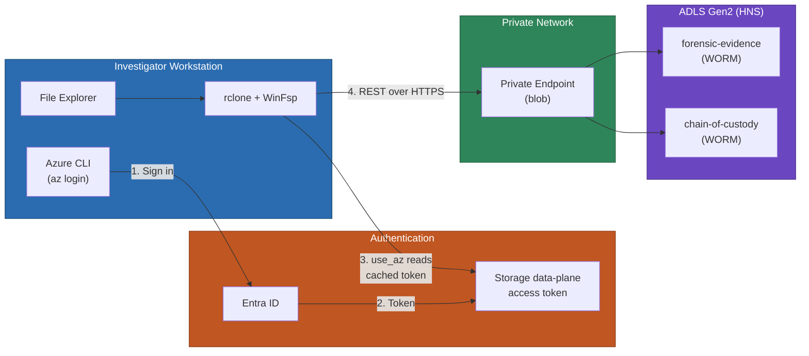
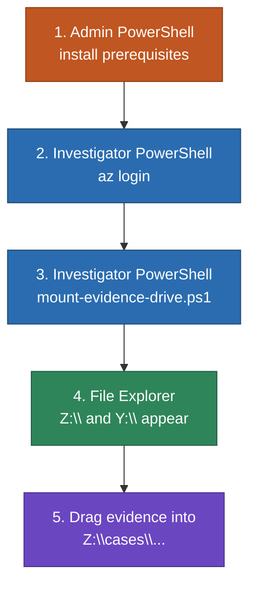
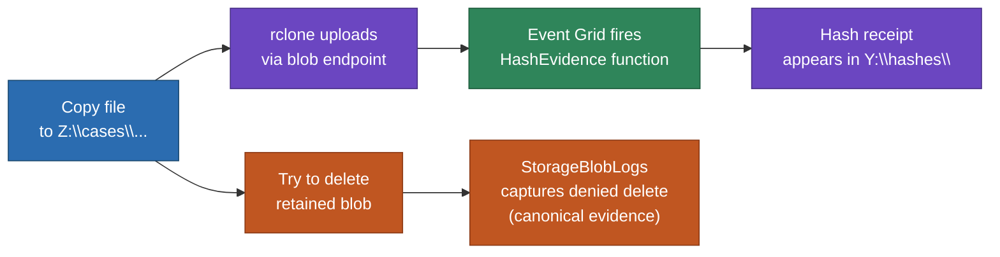

# Map a Windows Drive to Forensic Storage

Mount the `forensic-evidence` and `chain-of-custody` containers as Windows drive letters using **rclone + WinFsp**. Investigators get drag-and-drop in File Explorer while the storage layer continues to enforce WORM immutability, Entra ID authentication, and private-endpoint access.

> **Optional convenience path.** The mounted drive is great for browsing, light upload, and demo ergonomics. **For multi-GB evidence images (E01, raw disk), prefer Azure Storage Explorer or `azcopy` / `rclone copy`** — those tools surface progress and failures clearly. A mounted drive caches writes and can mask upload errors. See `docs/storage-explorer-setup.md` for the durable bulk path.

## Architecture



## What you get

| Drive | Container | Mode | Purpose |
| --- | --- | --- | --- |
| `Z:\` | `forensic-evidence` | Read-write | Drag-and-drop evidence into case folders |
| `Y:\` | `chain-of-custody` | Read-only (UX) | Verify hash receipts as files |

> **Be honest about the security boundary.** The `Y:` drive is read-only at the rclone layer as a UX guardrail. It is **not** the security boundary — investigators in this lab hold `Storage Blob Data Contributor` at the storage account scope, so they can still write to `chain-of-custody` through Storage Explorer, the CLI, the SDKs, or a different rclone config. The *real* protections on `chain-of-custody` are the container-level immutability policy and the audit log. For production, narrow the RBAC to container-scoped `Storage Blob Data Reader` on `chain-of-custody`.

## Prerequisites

| Component | Why | How |
| --- | --- | --- |
| **WinFsp** ≥ 2.0 | Windows kernel filesystem driver that rclone mounts on top of | `winget install WinFsp.WinFsp` (admin) |
| **rclone** ≥ 1.66 | Filesystem facade for Azure Blob Storage; `use_az` is mature in this version | `winget install Rclone.Rclone` (admin) |
| **Azure CLI** ≥ 2.50 | Token source for `use_az` Entra ID auth | [Install Azure CLI](https://learn.microsoft.com/cli/azure/install-azure-cli) |
| **`Storage Blob Data Contributor`** on the storage account | Needed for upload to `forensic-evidence` and read of `chain-of-custody` | Already assigned by `infra/modules/rbac.bicep` |

> **Authentication invariants.** This mount path uses **only** Entra ID via the Azure CLI cached token. No shared keys (the storage account has shared key access disabled), no account SAS, no service-principal secret. User-delegation SAS may still exist for separate controlled-download workflows where documented (see `docs/blob-download-url-sharing.md`); that is a different path from this mount.

## Quick start (scripted)



### 1. Install prerequisites (admin, once per workstation)

```powershell
# Open PowerShell as Administrator
.\scripts\mount-evidence-drive.ps1 -InstallPrerequisites
```

After install completes, **close the elevated window**.

### 2. Sign in as the investigator (non-elevated)

```powershell
# Open PowerShell as the investigator user (NOT elevated)
az login
az account set --subscription "<your-subscription-id>"
```

> **UAC trap.** If `az login` runs as the normal user but `mount-evidence-drive.ps1` runs as Administrator, the mounted drive will not appear in the investigator's File Explorer session. Always run `az login` and the mount in the **same** non-elevated window.

### 3. Mount

```powershell
.\scripts\mount-evidence-drive.ps1
```

The script:
1. Reads the resource group and storage-account name prefix from `infra/main.bicepparam`.
2. Discovers the deployed storage account name.
3. Confirms `az` is signed in and acquires a `https://storage.azure.com/` token.
4. Validates that `<account>.blob.core.windows.net` and `<account>.dfs.core.windows.net` resolve to private (RFC1918) addresses — proof that the storage stays on the private endpoint.
5. Verifies the requested drive letters are free.
6. Writes a per-user rclone config to `%LOCALAPPDATA%\forensic-lab\rclone\rclone.conf`.
7. Starts two rclone mount processes and waits for the drives to appear.
8. Records each mount's signature (PID, start time, executable path, command line, container) in `%LOCALAPPDATA%\forensic-lab\mounts\` so dismount can validate before terminating.

### 4. Use the drive

Open File Explorer:

- `Z:\` is the evidence vault. Create case folders **by copying files into them** — for example, copy `image.e01` directly to `Z:\cases\CASE-2024-001\drive-images\image.e01`. The HNS folders materialize as the file is created.
- `Y:\` is the chain-of-custody vault. Browse hash receipts with any text editor.

> **Don't pre-create empty folders through the mount.** rclone's Azure Blob backend treats directories as virtual prefixes; empty folders may not persist after refresh and creating placeholder files (`.keep`, `desktop.ini`) inside the WORM container creates immutable junk that also triggers the hash pipeline. Pre-create folder structure with Storage Explorer if you need it before any files exist.

### 5. Dismount

```powershell
.\scripts\dismount-evidence-drive.ps1
```

The script reads the recorded signatures and only stops rclone processes whose PID, start time, executable path, and command line all match — so it never kills an unrelated rclone you happened to have running.

## Verification



1. **Upload a test file.** Copy a small file to `Z:\cases\TEST\sample.txt`.
2. **Confirm it landed in storage.** Open Azure Storage Explorer and browse to the blob. (Don't trust the local Explorer view alone — rclone's VFS write cache reports success on close, not on durable upload completion.)
3. **Wait 15-30 seconds, then refresh** `Y:\hashes\TEST\` — the SHA-256 receipt should appear, written by the Azure Function in response to the `BlobCreated` event.
4. **Demonstrate WORM enforcement.** Try to delete the file from `Z:`. File Explorer will surface a generic Windows error. The **canonical** evidence of the immutability block is in `StorageBlobLogs`:

   ```kusto
   StorageBlobLogs
   | where TimeGenerated > ago(10m)
   | where OperationName == "DeleteBlob" and StatusCode == 409
   | project TimeGenerated, AccountName, Uri, RequesterAppId, RequesterObjectId, StatusText
   ```

   See `docs/lab-walkthrough.md` Act 5 for the full audit story.

> **Identity in the audit log.** Operations driven through this mount attribute to the same Entra ID principal that ran `az login`. Logs typically include `RequesterObjectId` (Entra object ID) and may not always show a friendly UPN — pre-test your KQL with the object ID if you are demoing live attribution.

## Token expiry

`az` access tokens expire after roughly one hour. rclone refetches via `az` on each token-needing operation, so as long as your `az login` session is still valid the mount keeps working. If your refresh token is revoked, MFA is re-required, or `az` is removed from PATH, mount operations will start failing with auth errors. To recover:

```powershell
az login
# Mount keeps running; the next operation picks up the refreshed token.
```

If errors persist, dismount and re-mount.

## Defender for Storage interaction

Defender for Storage scans uploaded blobs for malware. **This is independent of the chain-of-custody hash pipeline.** Don't conflate Defender events with hash receipts in the demo:

- **Hash pipeline** = Event Grid + Azure Function (`HashEvidence`) writing receipts to `chain-of-custody`.
- **Threat scanning** = Defender for Storage producing security alerts, separately, with its own latency.

## Manual setup (without the script)

If you want to wire this up by hand:

```powershell
# 1. Install prerequisites (admin)
winget install WinFsp.WinFsp
winget install Rclone.Rclone

# 2. Sign in (investigator user)
az login

# 3. Write rclone config
$cfgDir = "$env:LOCALAPPDATA\forensic-lab\rclone"
New-Item -ItemType Directory -Path $cfgDir -Force | Out-Null
@"
[forensic]
type = azureblob
account = <storage-account-name>
use_az = true
"@ | Set-Content "$cfgDir\rclone.conf" -Encoding ascii

# 4. Mount evidence (read-write)
rclone mount forensic:forensic-evidence Z: `
  --config "$cfgDir\rclone.conf" `
  --vfs-cache-mode writes `
  --network-mode `
  --volname "Forensic Evidence" `
  --exclude "desktop.ini" --exclude "Thumbs.db" `
  --exclude "`$RECYCLE.BIN/**" --exclude "System Volume Information/**"

# 5. In a separate window, mount chain-of-custody (read-only)
rclone mount forensic:chain-of-custody Y: `
  --config "$cfgDir\rclone.conf" --read-only `
  --network-mode --volname "Chain of Custody"
```

> The `--exclude` flags suppress Windows artifacts that would otherwise become immutable junk in the WORM container and pollute the hash pipeline.

## Troubleshooting

| Symptom | Likely cause | Fix |
| --- | --- | --- |
| `Z:` not in Explorer despite "mounted" message | Mount started in elevated shell, Explorer running non-elevated | Dismount, close elevated shell, re-run mount as the investigator user |
| `failed to authenticate: AADSTS70043` | `az` refresh token expired | Run `az login` again; existing mount picks up the new token |
| `permission denied` on copy to `Z:` | Missing `Storage Blob Data Contributor` on the storage account | Verify with `az role assignment list --assignee <upn> --scope <storage-id>` |
| `connection refused` / DNS to public IP | Workstation is not using an approved private path to the private endpoint | Confirm with `Resolve-DnsName <account>.blob.core.windows.net` — must be RFC1918 |
| Drive shows files but writes silently fail | VFS write cache filling up; check rclone log | Inspect `%LOCALAPPDATA%\forensic-lab\logs\Z-rclone.log`; free disk space |
| Hash receipt never appears in `Y:` | File didn't fully upload, or Function failed | Verify blob in Storage Explorer; check Function logs |
| `delete failed` on retained evidence | Expected — WORM is enforcing immutability | This is the demo moment; show it in `StorageBlobLogs` (Act 5) |
| Multiple match warning during dismount | PID reuse or unrelated rclone running | Check `Get-CimInstance Win32_Process -Filter "Name='rclone.exe'"`; remove stale state files manually if needed |

## Related access paths

| Path | Best for | Doc |
| --- | --- | --- |
| Azure Storage Explorer (GUI) | Bulk upload, ACLs, properties, the durable demo path | `docs/storage-explorer-setup.md` |
| `azcopy` / `rclone copy` (CLI) | Scripted bulk transfer with progress and retries | (use upstream docs) |
| **rclone mount (this doc)** | Drag-and-drop in File Explorer, browsing, light upload | this file |
| BlobFuse v2 (Linux) | Mount on Linux jump hosts (future scenario, not yet implemented) | `openspec/specs/investigator-access/spec.md` |
