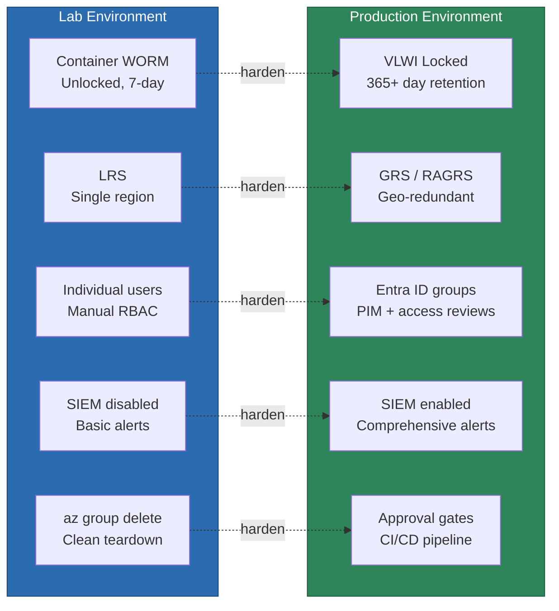
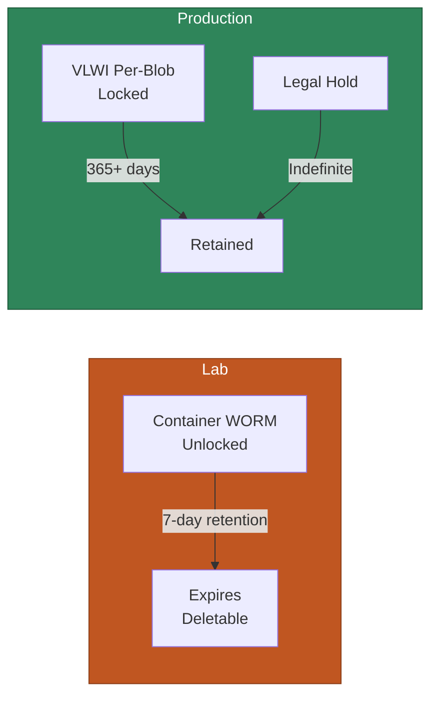
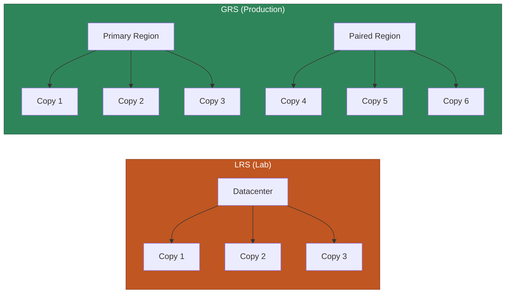
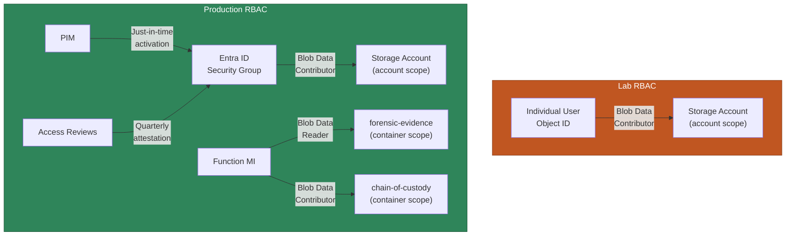
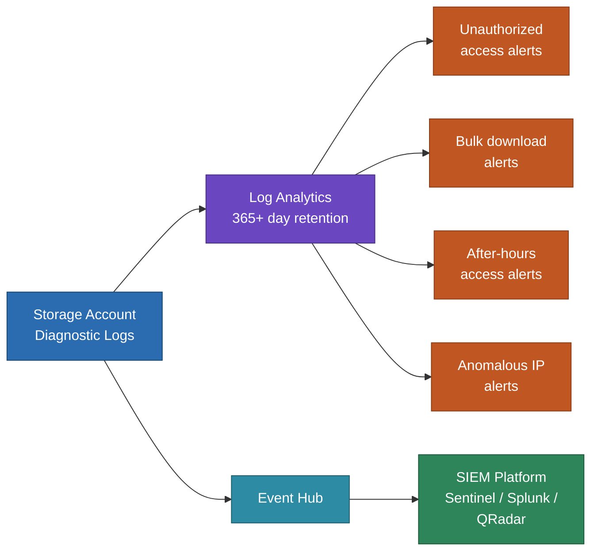
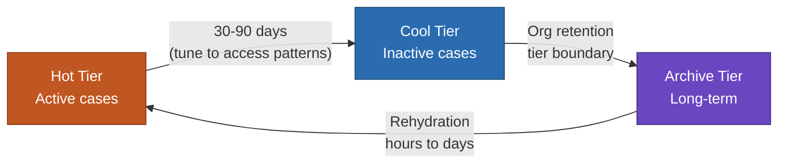
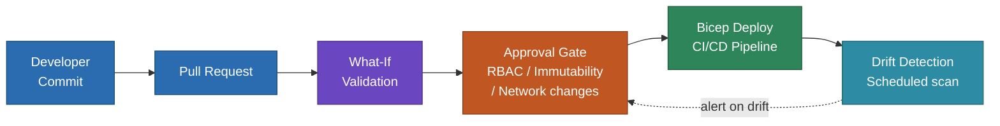

# Lab vs. Production — Deployment Guidance

This lab demonstrates forensic storage patterns using safe defaults for a sandbox environment. A production deployment would differ in several areas. This document captures each difference, why the lab chose the simpler option, and what a production deployment should do instead.

## At a Glance



---

## Immutability

| Aspect | Lab | Production |
|--------|-----|------------|
| **Immutability mode** | Container-level WORM (unlocked) | Version-level immutable storage (VLWI) or locked container policy |
| **Retention period** | 7 days | 365+ days (match organizational retention schedule) |
| **Policy state** | Unlocked (deletable for teardown) | **Locked** (permanent, required for HIPAA / NIST SP 800-53 / FRE 901/902) |

**Why the lab differs:** VLWI is permanently irreversible — once enabled on a container, the storage account cannot be deleted even when the container is empty. In a sandbox environment, this creates undeletable resources that persist until the subscription is decommissioned. Container-level WORM (unlocked) provides the same write-protection during the retention period but can be removed for cleanup.

**Production guidance:**
- Enable `immutableStorageWithVersioning` on the `forensic-evidence` container. This provides per-blob immutability that survives container deletion attempts.
- **Lock** the container-level policy after validation. Once locked, the retention period can be extended but never shortened or removed.
- Consider legal holds for active litigation — these override retention periods and persist until explicitly released.
- Document the locking decision with legal counsel. Locking is irreversible.

```bicep
// Production: enable VLWI on the container
resource forensicEvidence '...' = {
  properties: {
    immutableStorageWithVersioning: {
      enabled: true  // ⚠️ Permanently irreversible
    }
  }
}
```



---

## Storage Redundancy

| Aspect | Lab | Production |
|--------|-----|------------|
| **SKU** | `Standard_LRS` (locally redundant) | `Standard_GRS` or `Standard_RAGRS` (geo-redundant) |
| **Cross-region replication** | None | Automatic async replication to paired region |

**Why the lab differs:** LRS is cheaper and sufficient for a demo. Forensic evidence is irreplaceable — data loss is unacceptable per the user persona.

**Production guidance:**
- Use `Standard_GRS` at minimum. `Standard_RAGRS` adds read access to the secondary region for disaster recovery scenarios.
- For compliance regimes that require data residency, verify the paired region meets jurisdictional requirements before enabling GRS.
- The persona document states "data loss is unacceptable, but recovery time can be slow" — GRS satisfies this perfectly.



---

## Event Grid System Topic

| Aspect | Lab | Production |
|--------|-----|------------|
| **System topic management** | Resource-scoped subscription (Azure auto-manages topic) | Explicitly created system topic with naming and tagging |
| **Topic naming** | Auto-generated by Azure | Predictable name (e.g., `evgt-forensiclab-hns-blob`) |

**Why the lab differs:** Defender for Storage auto-creates a system topic on each storage account. On first deploy, our Bicep raced with Defender and failed. Resource-scoped subscriptions avoid this entirely.

**Production guidance:**
- Create the system topic explicitly with controlled naming and tags for cost tracking and governance.
- Deploy the system topic **before** enabling Defender for Storage, or handle the race by checking for an existing topic.
- If using resource-scoped subscriptions, accept that the auto-created system topic will have an Azure-generated name and no custom tags.

```bicep
// Production: explicit system topic for naming/tagging control
resource systemTopic 'Microsoft.EventGrid/systemTopics@2024-06-01-preview' = {
  name: 'evgt-${namePrefix}-blob'  // predictable name
  location: location
  tags: tags                        // cost tracking tags
  properties: {
    source: storageAccountId
    topicType: 'Microsoft.Storage.StorageAccounts'
  }
}
// Deploy this BEFORE enabling Defender, or sequence via dependsOn
```

---

## Function App Storage

| Aspect | Lab | Production |
|--------|-----|------------|
| **Authentication** | Identity-based (`AzureWebJobsStorage__accountName`) | Identity-based (same) or connection string with Key Vault |
| **Shared key access** | Disabled (sandbox enforces this) | Disabled (best practice) |
| **Content share** | `WEBSITE_RUN_FROM_PACKAGE` (no file share) | Flex Consumption plan with identity-based content share |

**Why the lab differs:** The sandbox environment forcibly blocks `allowSharedKeyAccess` on all storage accounts via platform policy. We worked around this with identity-based storage and run-from-package deployment.

**Production guidance:**
- Identity-based `AzureWebJobsStorage` is the recommended approach for Elastic Premium and Flex Consumption plans.
- If using Consumption plan (not recommended for VNet-integrated workloads), connection strings with Key Vault references are needed.
- Consider Flex Consumption for production — it supports identity-based content share natively and has faster cold start.

---

## Private Endpoint Posture

All storage access flows through private endpoints -- there is no public internet exposure. The access path to those endpoints is an implementation detail that varies by organization.

| Aspect | Lab | Production |
|--------|-----|------------|
| **Storage access** | Blob + DFS private endpoints | Organization-approved private endpoint subnet |
| **DNS** | Private DNS zones for blob + dfs | Centrally managed private DNS zones |
| **Address space** | Dynamic (`cidrSubnet()`) | IPAM-allocated, static |

The networking modules (`networking.bicep`, `private-endpoint.bicep`, `private-dns.bicep`) can be replaced by existing private endpoint and DNS resources. The storage, security, and workflow modules are independent of the specific access path.

---

## RBAC

| Aspect | Lab | Production |
|--------|-----|------------|
| **Investigator access** | Individual user principal IDs in `main.bicepparam` | Entra ID security groups |
| **Function app RBAC** | Account-level `Storage Blob Data Contributor` | Container-scoped roles per least privilege |
| **Principal management** | Manual param updates | Group membership managed in Entra ID |

**Why the lab differs:** The lab uses a single investigator principal for simplicity. The function app needs account-level access because it reads from `forensic-evidence` and writes to `chain-of-custody`.

**Production guidance:**
- Assign RBAC to Entra ID security groups, not individual users. Set `principalType: 'Group'` in the Bicep.
- For the function app, consider two separate role assignments at container scope: `Storage Blob Data Reader` on `forensic-evidence` and `Storage Blob Data Contributor` on `chain-of-custody`.
- Use Privileged Identity Management (PIM) for just-in-time access to sensitive containers.
- Implement access reviews for ongoing attestation of investigator access.



---

## Monitoring and SIEM

| Aspect | Lab | Production |
|--------|-----|------------|
| **SIEM export** | Disabled (`enableSiemExport = false`) | Enabled — Event Hub to Sentinel/Splunk/QRadar |
| **Log retention** | Default (30 days in LAW) | 365+ days (match evidence retention) |
| **Alerting** | Basic delete-attempt alert | Comprehensive alert rules for anomalous access patterns |

**Why the lab differs:** SIEM integration requires an Event Hub and downstream consumer, adding cost and complexity beyond the demo scope.

**Production guidance:**
- Enable `enableSiemExport = true` and configure the Event Hub consumer for your SIEM platform.
- Set Log Analytics workspace retention to match your immutability retention period.
- Create alert rules for: unauthorized access attempts, bulk downloads, access from unexpected IPs, and after-hours access.
- Configure diagnostic settings to capture `StorageBlobLogs` at the `allLogs` level.



---

## Lifecycle Tiering

| Aspect | Lab | Production |
|--------|-----|------------|
| **Hot → Cool** | 60 days | Validate with actual access patterns (may be 30-90 days) |
| **Cool → Archive** | 730 days | Align with organizational retention tiers |
| **Archive rehydration** | Not tested | Test rehydration time and cost; document SLA for evidence retrieval |

**Why the lab differs:** The 60/730-day defaults model a reasonable forensic lifecycle but haven't been validated against actual access patterns.

**Production guidance:**
- Analyze `StorageBlobLogs` to determine actual last-access times before setting tiering thresholds.
- Archive tier rehydration takes hours to days — document this in the evidence retrieval SLA.
- Consider `enableLastAccessTimeTracking` on the storage account for access-based tiering (more precise than modification-based).
- The persona states investigators "occasionally retrieve older data if needed for legal or other requests, but that is rare" — this supports aggressive archival tiering.



---

## Integrating Into an Existing Environment

The lab is greenfield — it provisions its own VNet, private DNS zones, and Log Analytics workspace. In a real org you almost certainly want to drop the **storage + security + workflow** core into an existing landing zone and reuse centrally managed resources where appropriate.

### Module-by-module integration matrix

| Module | Greenfield (lab default) | Brownfield (existing env) |
|---|---|---|
| `storage-account.bicep` | **Keep** — this is the lab's reason for existing | **Keep** |
| `containers.bicep` | **Keep** — `forensic-evidence` + `chain-of-custody` + WORM | **Keep**, lock the immutability policy |
| `lifecycle.bicep` | **Keep** — Hot → Cool → Archive | **Keep**, tune thresholds from access patterns |
| `event-grid.bicep` | **Keep** — Defender topic + hash subscription | **Keep**; consider explicit system topic (see Event Grid section) |
| `function-app.bicep` | **Keep** — hashing function + identity-based storage | **Keep**; switch to Flex Consumption for production |
| `rbac.bicep` | **Keep** — role assignments | **Keep**, but pass group object IDs instead of users |
| `monitoring.bicep` | Creates new LAW | **Swap** — diag settings should target your central LAW |
| `siem-export.bicep` | Off by default | **Enable**, target your enterprise Event Hub namespace |
| `networking.bicep` | Creates new VNet + `snet-private-endpoints` | **Swap** — use your existing approved private endpoint subnet |
| `private-dns.bicep` | Creates `privatelink.blob.core.windows.net` + `.dfs` zones in this RG | **Swap** — reference centrally managed private DNS zones |
| `private-endpoint.bicep` | **Keep** — but point at existing subnet + DNS zone IDs | **Keep** |

### Bring-your-own-resource pattern

Brownfield deployments need to replace four "infrastructure" inputs. The `storage-account`, `containers`, `lifecycle`, `event-grid`, `function-app`, and `rbac` modules already work without modification — the integration work is in `main.bicep` plumbing.

| Concern | Lab today | Brownfield change |
|---|---|---|
| VNet / subnet | `networking.bicep` creates them | Add `existingSubnetId string` param to `main.bicep`; pass directly to `private-endpoint.bicep`; skip the `networking` module |
| Private DNS | `private-dns.bicep` creates and links the zone | Add `existingBlobPrivateDnsZoneId` + `existingDfsPrivateDnsZoneId` params; pass to `private-endpoint.bicep`; skip `private-dns` |
| Log Analytics | `monitoring.bicep` creates a new workspace | Add `existingLogAnalyticsWorkspaceId` param; rewrite `monitoring.bicep` to attach `diagnosticSettings` to the existing workspace by ID |
| Function content storage | `storage-account.bicep` deploys an HNS account; function uses identity-based access | No change — the function already uses managed identity |

These params don't exist in `main.bicep` yet. This is the next logical hardening step before merging this lab pattern into a landing-zone repo.

### Encryption with Customer-Managed Keys

Lab uses Microsoft-managed keys (default). Production forensic stores typically require CMK for compliance attestation:

- Store the key in a centrally-managed Key Vault (HSM-backed for FIPS 140-2 Level 3).
- Grant the storage account's managed identity `Key Vault Crypto Service Encryption User`.
- Configure account-level CMK with `keyVaultProperties` on the storage account.
- Document the key rotation schedule and recovery procedures — losing the key means losing the evidence.

`storage-account.bicep` does not currently configure CMK. This is the second hardening step.

### Central monitoring and SIEM

Most enterprises route all diagnostics to a central Log Analytics workspace, with Sentinel onboarded to the same workspace.

- Replace `monitoring.bicep`'s workspace creation with a `diagnosticSettings` resource that targets `existingLogAnalyticsWorkspaceId` (Storage account's `StorageBlobLogs`, `StorageRead`, `StorageWrite`, `StorageDelete`, `Transaction`).
- The KQL queries in `docs/audit-queries-portal.md` work unchanged against the central workspace once diagnostics are flowing.
- Sentinel analytics rules can sit in the central workspace and apply to all storage accounts in scope.

### Landing Zone alignment

This pattern slots into a typical workload spoke:

| CAF concern | This lab |
|---|---|
| **Subscription placement** | Workload (Corp) landing zone, not Online — private endpoint only |
| **Naming convention** | `namePrefix` param controls all resource names; replace with your org's convention (e.g., `<prefix>-<env>-<region>`) |
| **Tagging policy** | All modules accept a `tags object` param; populate from your standard tag taxonomy |
| **Azure Policy** | Compatible with deny-public-network, require-private-endpoint, require-tag policies; check `enforce-tls12` policy if your org has it |
| **Resource group** | Single-purpose RG aligned to the workload — don't co-locate with unrelated apps |

## Deployment and Teardown

| Aspect | Lab | Production |
|--------|-----|------------|
| **Teardown** | `az group delete` works cleanly (no VLWI) | Teardown requires policy removal, legal hold release, and retention period expiry |
| **Deployment** | Single `az deployment sub create` | CI/CD pipeline with what-if validation, approval gates, and drift detection |
| **State management** | Bicep params file committed to repo | Separate param files per environment; secrets in Key Vault |

**Production guidance:**
- Use `az deployment sub what-if` before every production deployment.
- Implement deployment approval gates for changes to immutability policies, RBAC, or network rules.
- Store environment-specific parameters (principal IDs, retention periods) separately from the Bicep templates.
- Plan for the fact that VLWI storage accounts **cannot be deleted** — budget for the storage cost through the full retention period even if the project is decommissioned.


