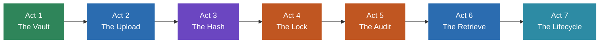
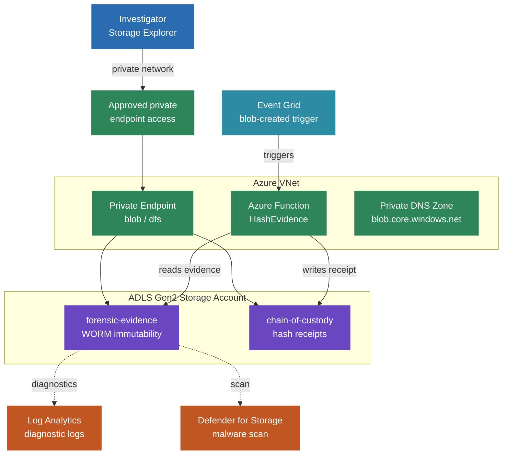
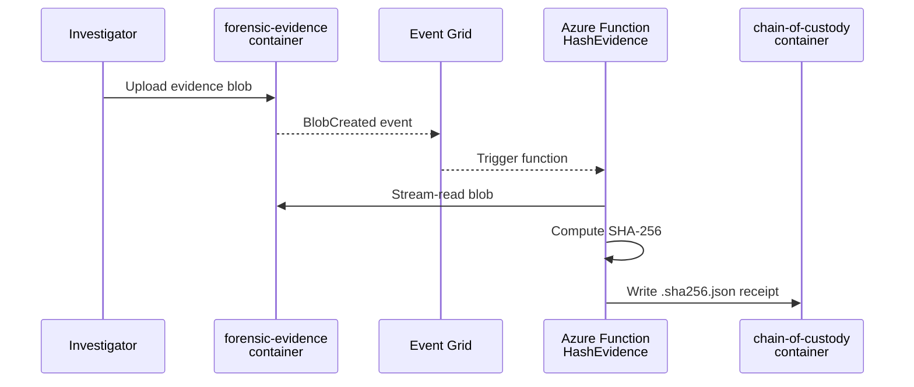
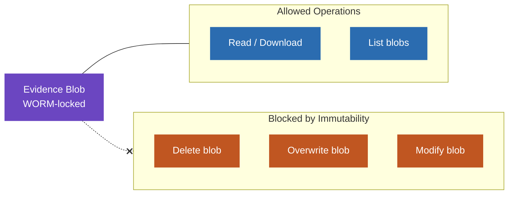
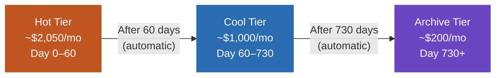

# Forensic Storage Lab — 7-Act Demo Walkthrough

This lab demonstrates how Azure Blob Storage serves as an immutable, auditable vault for forensic evidence. The architecture is simple by design: one storage account, a `forensic-evidence` container for WORM-immutable evidence, a `chain-of-custody` container for automated hash receipts, Azure Storage Explorer as the interface, and an Azure Function for automated hashing on upload.

**Duration:** 30–45 minutes  
**Audience:** Forensic investigators, IT security leads, legal/compliance stakeholders

### Demo Flow Overview



---

## Prerequisites

Before beginning the demo, ensure you have:

- **Azure subscription** with permissions to create resource groups, storage accounts, VNets, private endpoints, Function Apps, and assign RBAC roles
- **Azure CLI** (v2.50+): [Install](https://learn.microsoft.com/cli/azure/install-azure-cli)
- **Bicep CLI** (bundled with Azure CLI): verify with `az bicep version`
- **Azure Storage Explorer**: [Download](https://azure.microsoft.com/products/storage/storage-explorer/)
- **PowerShell** (v7+ recommended)
- Approved private endpoint access to the storage account

### Authentication

```bash
az login
az account set --subscription "<your-subscription-id>"
```

### Identify Investigator Principals

Each investigator needs an Entra ID Object ID:

```bash
az ad user show --id "investigator@yourdomain.com" --query id --output tsv
```

Add all principal IDs to `infra/main.bicepparam` in the `investigatorPrincipalIds` array.

---

## Act 1 — The Vault

**Goal:** Show the infrastructure that makes Azure a forensic vault.

### 1.1 Deploy the Infrastructure

Edit `infra/main.bicepparam` to set your region, investigator IDs, and review parameter defaults:

| Parameter | Default | Purpose |
|-----------|---------|---------|
| `retentionDays` | `365` | Immutability retention period |
| `hotToCoolDays` | `60` | Days before tiering to Cool |
| `coolToArchiveDays` | `730` | Days before tiering to Archive |
| `enableSiemExport` | `false` | Optional Event Hub for SIEM integration |

Deploy:

```bash
az deployment sub create \
  --location eastus2 \
  --template-file infra/main.bicep \
  --parameters infra/main.bicepparam
```

This creates:
- A storage account with **HNS enabled** (ADLS Gen2), versioning, soft delete, and public access disabled
- A `forensic-evidence` container with time-based immutability (365 days) for WORM-locked evidence
- A `chain-of-custody` container for automated hash receipts (written by the Azure Function)
- Private endpoint — no public access
- Entra ID authentication only (shared keys disabled)
- Lifecycle rules (Hot → Cool → Archive)
- Log Analytics workspace with diagnostic logging
- Microsoft Defender for Storage with malware scanning
- Alert rule for delete attempts
- RBAC: Storage Blob Data Contributor for each investigator
- Azure Function for automated SHA-256 hashing
- Event Grid subscription to trigger hashing on blob uploads

### Lab Architecture



### 1.2 Verify Private Endpoint Reachability

The storage account is private-endpoint-only -- there is no public internet access. Before proceeding, ensure the storage account FQDN resolves to a private IP from your approved access location.

### 1.3 Walk Through the Portal

Open the Azure Portal and show:
1. **Storage account** → Overview: HNS enabled, public access disabled, shared keys disabled
2. **Networking** → Private endpoint connections: private-only access
3. **Entra ID authentication**: no access keys available
4. **Defender for Storage**: enabled with malware scanning
5. **Containers**: single `forensic-evidence` container
6. **Immutability policy**: time-based retention active

> **Talking point:** This replaces a local NAS with platform-enforced immutability. No investigator — or administrator — can delete retained evidence, even with Contributor access.

---

## Act 2 — The Upload

**Goal:** Show how investigators upload evidence using familiar tools.

### 2.1 Connect Storage Explorer

1. Open Azure Storage Explorer
2. Sign in with your Entra ID account
3. Navigate to the storage account under your subscription
4. Expand **Blob Containers** → `forensic-evidence`

See `docs/storage-explorer-setup.md` for detailed setup instructions.

### 2.2 Create Case Folder Structure

In Storage Explorer, create the folder hierarchy for a case:

```
forensic-evidence/
  cases/
    CASE-2024-001/
      drive-images/
      email/
      phone/
```

Right-click → **Create New Folder** at each level.

### 2.3 Upload Sample Evidence

Prepare sample files:

```powershell
New-Item -ItemType Directory -Path .\sample-data -Force
$bytes = [byte[]]::new(1024 * 100)  # 100 KB
[System.Security.Cryptography.RandomNumberGenerator]::Fill($bytes)
[System.IO.File]::WriteAllBytes(".\sample-data\case-2024-001-disk.raw", $bytes)

$emailContent = "From: suspect@example.com`nSubject: Test`n`nSample email."
[System.IO.File]::WriteAllText(".\sample-data\case-2024-001-mailbox.pst", $emailContent)
```

Drag and drop files into the appropriate folders in Storage Explorer:
- `case-2024-001-disk.raw` → `cases/CASE-2024-001/drive-images/`
- `case-2024-001-mailbox.pst` → `cases/CASE-2024-001/email/`

> **Talking point:** Upload is drag-and-drop — the same gesture as copying files to a network share. No scripts, no CLI, no training required.

### 2.4 Optional: Map Storage as a Windows Drive

For investigators who prefer to work in File Explorer instead of Storage Explorer, the same containers can be mounted as Windows drive letters using rclone + WinFsp. This is an **optional convenience path** — Storage Explorer (or `azcopy` / `rclone copy`) remains the recommended way to ingest multi-GB evidence images.

```powershell
# Once per workstation, as Administrator:
.\scripts\mount-evidence-drive.ps1 -InstallPrerequisites

# Then as the investigator user (non-elevated), after `az login`:
.\scripts\mount-evidence-drive.ps1
```

The script discovers the storage account, validates that DNS resolves to a private address, and mounts:

- `Z:\` → `forensic-evidence` (read-write)
- `Y:\` → `chain-of-custody` (read-only as a UX guardrail)

Authentication is Entra ID via the Azure CLI cached token — no shared keys, no SAS. Drag a file to `Z:\cases\CASE-2024-001\drive-images\` and the upload, hash pipeline, and audit trail behave exactly as in Act 3 and Act 5. To dismount, run `.\scripts\dismount-evidence-drive.ps1`.

See `docs/drive-mapping-setup.md` for prerequisites, manual setup, HNS folder caveats, and troubleshooting.

> **Talking point:** Same vault, same controls — different gesture. Investigators who live in File Explorer can drag-and-drop into a drive letter; the storage layer still enforces WORM, identity-based audit, and private-endpoint access.

---

## Act 3 — The Hash

**Goal:** Demonstrate automated chain-of-custody integrity verification.

### 3.1 Automatic Hashing on Upload

No manual step is required. When you uploaded evidence in Act 2, the hash pipeline fired automatically:



1. **Event Grid** detected the new blob in `forensic-evidence`
2. **Azure Function (HashEvidence)** was triggered automatically
3. The function stream-read the blob and computed its SHA-256 hash
4. A JSON **chain-of-custody receipt** was written to the `chain-of-custody` container

The receipt path mirrors the evidence path with a `.sha256.json` suffix:
```
chain-of-custody/cases/CASE-2024-001/drive-images/case-2024-001-disk.raw.sha256.json
```

Because evidence blobs are WORM-immutable, the function cannot write metadata back to the evidence blob. Instead, the receipt is a separate blob in the `chain-of-custody` container — a clean separation of evidence from chain-of-custody records.

### 3.2 View the Chain-of-Custody Receipt

In Storage Explorer:
1. Navigate to the `chain-of-custody` container
2. Browse to the matching case path (mirrors the evidence path)
3. Open the `.sha256.json` receipt — you'll see:

| Field | Example Value |
|-------|---------------|
| `evidenceBlob` | `cases/CASE-2024-001/drive-images/case-2024-001-disk.raw` |
| `evidenceContainer` | `forensic-evidence` |
| `storageAccount` | `forensiclab...` |
| `hashAlgorithm` | `SHA-256` |
| `hashValue` | `a3f2b7c8d9e...` (64-character lowercase hex) |
| `evidenceSizeBytes` | `102400` |
| `hashedAt` | `2024-04-13T14:30:00Z` |
| `hashedBy` | `azure-function/HashEvidence` |
| `eventId` | Event Grid event ID for traceability |

### 3.3 Verify (Optional CLI)

Download and inspect the receipt:

```powershell
az storage blob download `
  --account-name <storage-account-name> `
  --container-name chain-of-custody `
  --name "cases/CASE-2024-001/drive-images/case-2024-001-disk.raw.sha256.json" `
  --file "$env:TEMP\evidence-receipt.json" `
  --auth-mode login

Get-Content "$env:TEMP\evidence-receipt.json" | ConvertFrom-Json | Format-List
```

Or run the full verification (downloads evidence, recomputes hash, compares):

```powershell
.\scripts\verify-integrity.ps1 `
  -StorageAccountName <storage-account-name> `
  -BlobName "cases/CASE-2024-001/drive-images/case-2024-001-disk.raw"
```

Expected: `RESULT: PASS - Hashes match. Evidence integrity verified.`

> **Talking point:** SHA-256 replaces the old MD5 procedural checksums. The hash is computed server-side by a VNet-integrated Azure Function — no investigator action required beyond uploading. A separate chain-of-custody receipt is written automatically, keeping evidence blobs untouched and WORM-immutable. The receipt includes hash, timestamp, function identity, and event ID — all available for court proceedings.

---

## Act 4 — The Lock

**Goal:** Prove immutability is platform-enforced, not procedural.



### 4.1 Attempt to Delete Evidence

```bash
az storage blob delete \
  --account-name <storage-account-name> \
  --container-name forensic-evidence \
  --name "cases/CASE-2024-001/drive-images/case-2024-001-disk.raw" \
  --auth-mode login
```

**Expected:** Operation denied with immutability policy error.

### 4.2 Attempt to Overwrite Evidence

```bash
az storage blob upload \
  --account-name <storage-account-name> \
  --container-name forensic-evidence \
  --name "cases/CASE-2024-001/drive-images/case-2024-001-disk.raw" \
  --file sample-data/case-2024-001-disk.raw \
  --auth-mode login --overwrite true
```

**Expected:** Overwrite denied by immutability policy.

### 4.3 Legal Hold Demo

Apply a legal hold for an active case:

```bash
az storage container legal-hold set \
  --account-name <storage-account-name> \
  --container-name forensic-evidence \
  --tags "case-2024-001" \
  --auth-mode login
```

Legal hold provides indefinite immutability — evidence cannot be deleted even after the retention period expires, until the hold is explicitly removed. See `docs/legal-hold-commands.md`.

> **Talking point:** Even with Storage Blob Data Contributor role, investigators cannot bypass immutability. This is a platform guarantee, not a policy document. It holds up in court because the control is technical, not procedural.

---

## Act 5 — The Audit

**Goal:** Show the complete audit trail of who did what, when.

### 5.1 Wait for Logs

Diagnostic logs take 5–15 minutes to appear in Log Analytics.

### 5.2 Query All Activity

In the Azure Portal → Log Analytics workspace → Logs:

```kusto
StorageBlobLogs
| where TimeGenerated > ago(1h)
| where ObjectKey has "forensic-evidence"
| project TimeGenerated, RequesterUpn, CallerIpAddress, OperationName, ObjectKey, StatusCode
| order by TimeGenerated desc
| take 50
```

### 5.3 Query Failed Delete Attempts

```kusto
StorageBlobLogs
| where OperationName startswith "Delete"
| where ObjectKey has "forensic-evidence"
| where StatusCode >= 400
| project TimeGenerated, RequesterUpn, CallerIpAddress, OperationName, ObjectKey, StatusCode, StatusText
| order by TimeGenerated desc
```

### 5.4 Differentiate Investigators

```kusto
StorageBlobLogs
| where ObjectKey has "forensic-evidence"
| summarize OperationCount = count() by RequesterUpn, OperationName
| order by OperationCount desc
```

### 5.5 Track Hash Receipt Events

```kusto
StorageBlobLogs
| where ObjectKey has "chain-of-custody"
| where OperationName == "PutBlob"
| project TimeGenerated, AccountName, ObjectKey, StatusCode, CallerIpAddress
| order by TimeGenerated desc
```

> **Note:** The `CallerIpAddress` will be the Azure Function's VNet IP (10.0.3.x range), proving the function accessed storage via private network — not over the public internet.

> **Talking point (SIEM):** By default, all logs flow to Log Analytics. For organizations with external SIEM/SOC tooling, the optional SIEM export module (`enableSiemExport = true`) forwards these same events to an Event Hub that any SIEM platform can consume.

---

## Act 6 — The Retrieve

**Goal:** Show evidence retrieval and integrity verification.

### 6.1 Download Evidence

In Storage Explorer:
1. Navigate to the blob
2. Right-click → **Download**
3. Choose a local destination

### 6.2 Verify SHA-256

Download the chain-of-custody receipt and compare against a locally computed hash:

```powershell
# Download the hash receipt
az storage blob download `
  --account-name <storage-account-name> `
  --container-name chain-of-custody `
  --name "cases/CASE-2024-001/drive-images/case-2024-001-disk.raw.sha256.json" `
  --file "$env:TEMP\evidence-receipt.json" `
  --auth-mode login

# View the receipt
Get-Content "$env:TEMP\evidence-receipt.json" | ConvertFrom-Json | Format-List

# Download evidence and compute local hash
$localHash = (Get-FileHash -Path ".\downloaded-evidence\case-2024-001-disk.raw" -Algorithm SHA256).Hash.ToLower()
$receipt = Get-Content "$env:TEMP\evidence-receipt.json" | ConvertFrom-Json
Write-Host "Local:   $localHash"
Write-Host "Receipt: $($receipt.hashValue)"
Write-Host "Match:   $($localHash -eq $receipt.hashValue)"
```

Or use the verification script (automates all of the above):

```powershell
.\scripts\verify-integrity.ps1 `
  -StorageAccountName <storage-account-name> `
  -BlobName "cases/CASE-2024-001/drive-images/case-2024-001-disk.raw"
```

### 6.3 Rehydrate Archived Blob (Demo Discussion)

For blobs that have been tiered to Archive, rehydration is required before download:

```bash
az storage blob set-tier \
  --account-name <storage-account-name> \
  --container-name forensic-evidence \
  --name "cases/CASE-2024-001/drive-images/case-2024-001-disk.raw" \
  --tier Hot \
  --auth-mode login
```

Rehydration takes up to 15 hours (standard priority). Immutability is preserved through tier changes.

> **Talking point:** Retrieval is rare — typically only for legal review requests or case re-examination. The 99% use case is data sitting undisturbed in Cool or Archive tier at minimal cost.

---

## Act 7 — The Lifecycle

**Goal:** Show automated cost management and long-term retention economics.



*Costs shown for 100 TB on LRS in East US 2. Immutability is preserved through all tier transitions.*

### 7.1 Review Lifecycle Rules in Portal

Azure Portal → Storage account → Lifecycle management:

| Rule | Action | Trigger |
|------|--------|---------|
| `tier-evidence-to-cool` | Hot → Cool | After 60 days (configurable) |
| `tier-evidence-to-archive` | Cool → Archive | After 730 days (configurable) |

### 7.2 Cost Comparison

For a 100 TB evidence archive:

| Tier | Monthly Cost (LRS, East US 2) | Annual Cost |
|------|------|------|
| Hot | ~$2,050 | ~$24,600 |
| Cool | ~$1,000 | ~$12,000 |
| Archive | ~$200 | ~$2,400 |

With lifecycle tiering, a typical evidence dataset (mostly inactive) moves from Hot → Cool → Archive automatically, reducing annual storage costs by **~90%** compared to keeping everything Hot.

### 7.3 GRS vs LRS Discussion

| | LRS | GRS |
|--|-----|-----|
| Replicas | 3 copies in one datacenter | 6 copies across 2 regions |
| Cost | Base | ~2x for Hot, ~2x for Cool/Archive |
| Use case | Lab/demo | Production — legal risk mitigation |
| Recovery | Protects against disk failure | Protects against regional disaster |

> **Talking point:** This lab uses LRS for cost efficiency. For production forensic archives, GRS provides geo-redundancy that may be required for legal comfort — the data survives even if an entire Azure region is lost.

### 7.4 Immutability After Tiering

Demonstrate that immutability is preserved:
- A blob in Cool or Archive tier still cannot be deleted
- Legal holds remain active regardless of tier
- Hash receipts in chain-of-custody container are preserved through tier transitions

---

## Cleanup

> **Warning**: This permanently deletes all lab resources.

### Remove Legal Holds First

```bash
az storage container legal-hold clear \
  --account-name <storage-account-name> \
  --container-name forensic-evidence \
  --tags "case-2024-001" \
  --auth-mode login
```

### Delete Resources

```bash
az group delete --name rg-forensic-storage-lab --yes --no-wait
```

### Clean Up Local Files

```powershell
Remove-Item -Path .\sample-data -Recurse -Force
```

---

## Summary

| Act | Capability | What You Saw |
|-----|-----------|--------------|
| 1 | **The Vault** | Private endpoint, Entra ID, HNS, Defender — the platform guarantees |
| 2 | **The Upload** | Drag-and-drop in Storage Explorer — familiar, zero training |
| 3 | **The Hash** | Automated SHA-256 receipts in chain-of-custody container — fully automatic on upload |
| 4 | **The Lock** | Platform-enforced immutability — even Contributor can't delete |
| 5 | **The Audit** | KQL queries differentiating investigators, tracking every operation |
| 6 | **The Retrieve** | Download + receipt-based hash verification — end-to-end integrity chain |
| 7 | **The Lifecycle** | 90% cost reduction via automated tiering, immutability preserved |

Azure replaces the unprotected NAS with a platform that guarantees immutability, records every access, and reduces storage costs by 90% — while keeping the investigator experience as simple as drag-and-drop.
