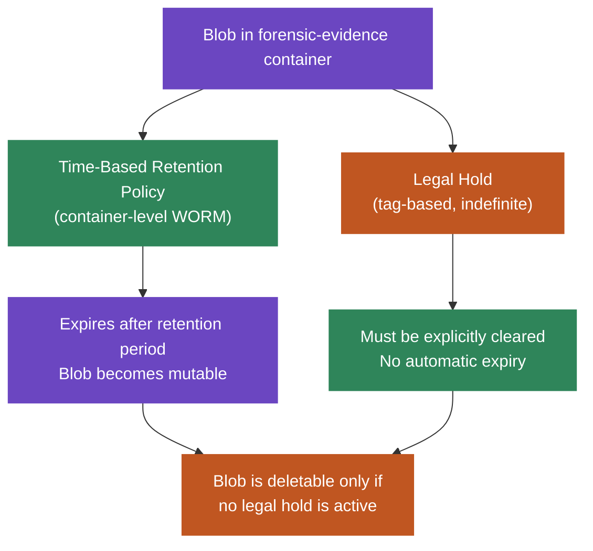
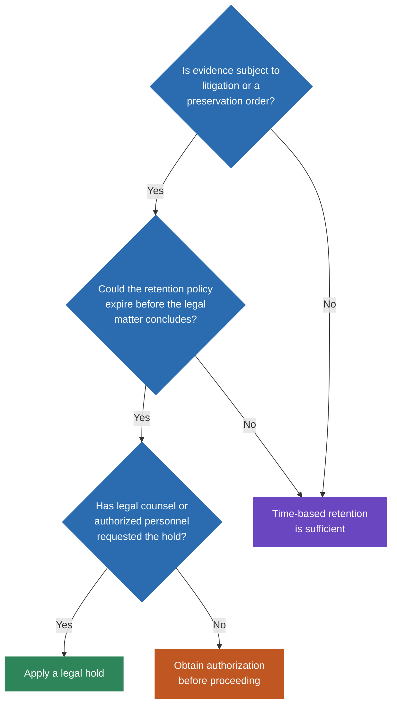

# Legal Hold Commands

Legal hold provides an indefinite immutability lock on blobs, independent of time-based retention policies. Use legal holds when evidence is subject to active litigation or preservation orders.

## How Legal Hold Fits Into Immutability

The `forensic-evidence` container uses container-level WORM immutability (unlocked in lab, locked in production). Legal holds add a second, independent layer of protection. Both mechanisms prevent deletion and modification, but they serve different purposes and are managed separately.



## Should I Apply a Legal Hold?

Use this decision tree to determine whether a legal hold is appropriate.



## Apply a Legal Hold

```bash
az storage container legal-hold set \
  --account-name <storage-account-name> \
  --container-name forensic-evidence \
  --tags "case-2024-001" \
  --auth-mode login
```

You can apply multiple tags to track different legal matters:

```bash
az storage container legal-hold set \
  --account-name <storage-account-name> \
  --container-name forensic-evidence \
  --tags "case-2024-001" "case-2024-002" \
  --auth-mode login
```

## Verify Legal Hold Status

```bash
az storage container show \
  --account-name <storage-account-name> \
  --name forensic-evidence \
  --query "properties.hasLegalHold" \
  --auth-mode login
```

To see all active legal hold tags:

```bash
az storage container show \
  --account-name <storage-account-name> \
  --name forensic-evidence \
  --query "properties.legalHold.tags" \
  --auth-mode login
```

## Remove a Legal Hold

> **Warning:** Only remove a legal hold when the associated legal matter has concluded and authorized personnel have approved the release.

```bash
az storage container legal-hold clear \
  --account-name <storage-account-name> \
  --container-name forensic-evidence \
  --tags "case-2024-001" \
  --auth-mode login
```

## Legal Hold Lifecycle

```mermaid
flowchart LR
    style A fill:#2B6CB0,stroke:#2B6CB0,color:#fff
    style B fill:#C05621,stroke:#C05621,color:#fff
    style C fill:#2F855A,stroke:#2F855A,color:#fff
    style D fill:#6B46C1,stroke:#6B46C1,color:#fff
    style E fill:#2B6CB0,stroke:#2B6CB0,color:#fff
    style F fill:#2D8BA4,stroke:#2D8BA4,color:#fff
    style G fill:#2F855A,stroke:#2F855A,color:#fff

    A["Litigation or<br/>preservation order<br/>received"] --> B["Obtain authorization<br/>from legal counsel"]
    B --> C["Apply legal hold<br/>with case tag"]
    C --> D["Evidence is protected<br/>(immutable, indefinite)"]
    D --> E["Legal matter<br/>concludes"]
    E --> F["Obtain release<br/>approval"]
    F --> G["Clear legal hold tag"]
```



## Important Notes

- Legal holds are independent of time-based retention policies -- both can be active simultaneously
- While a legal hold is active, blobs cannot be deleted or overwritten regardless of retention policy state
- Legal hold operations are logged in diagnostic settings and visible in the audit trail
- Legal holds use tags to track which legal matter or case triggered the hold
- All legal hold operations require `--auth-mode login` since shared key access is disabled on this storage account
- Legal holds remain active through tier transitions (Cool, Archive) -- evidence stays protected regardless of storage tier
- Legal holds apply at the container level to `forensic-evidence`; the `chain-of-custody` container is separately protected by its own immutability policy
