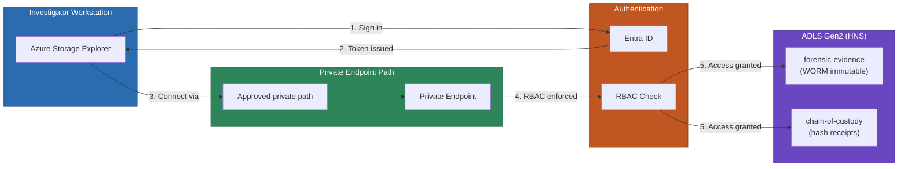
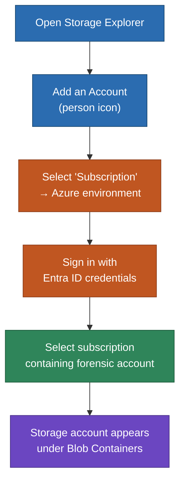
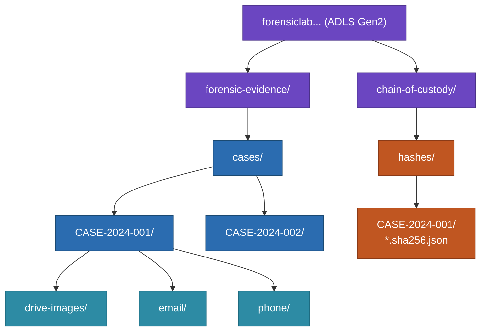
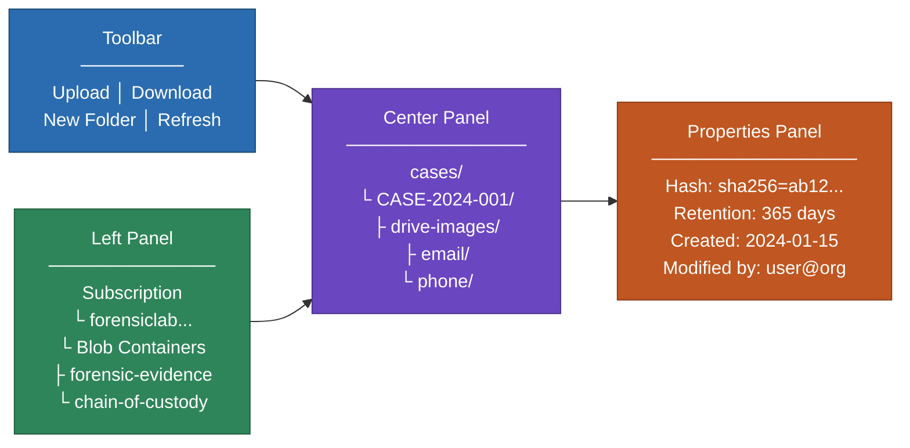
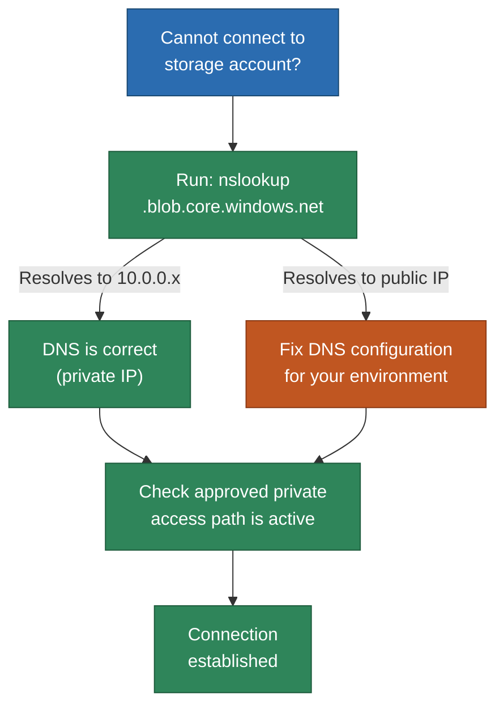

# Azure Storage Explorer Connection Guide

Connect to the forensic storage account using Azure Storage Explorer with Entra ID authentication over the private endpoint.

## Architecture Overview



## Prerequisites

- [Azure Storage Explorer](https://azure.microsoft.com/products/storage/storage-explorer/) installed (Windows)
- Entra ID account with **Storage Blob Data Contributor** role on the storage account
- Approved private endpoint access to the storage account

## Step 1: Sign In with Entra ID



1. Open Azure Storage Explorer
2. Click **Add an account** (person icon in the left toolbar) or go to **Edit > Add an Account**
3. Select **Subscription** and click **Next**
4. Select **Azure** as the Azure environment
5. Click **Sign in** and authenticate with your organizational Entra ID account
6. After sign-in, select the subscription containing the forensic storage account and click **Apply**

> **Note:** Shared key access is disabled on this storage account. You must sign in with Entra ID -- access keys and SAS tokens will not work.

## Step 2: Navigate to the Storage Account

1. In the left panel under **Storage Accounts**, expand the subscription
2. Locate the forensic storage account (e.g., `forensiclab...`)
3. Expand **Blob Containers** to see the two containers:
   - `forensic-evidence` -- WORM-immutable evidence storage
   - `chain-of-custody` -- hash receipts and audit records

### Container and Folder Hierarchy

Because HNS (Hierarchical Namespace) is enabled, Storage Explorer shows real folders (not virtual prefixes). You can create, rename, and set ACLs on folders directly.



## Step 3: Working with Evidence

### What an Investigator Sees in Storage Explorer



### Upload Evidence

- **Drag and drop** files from Windows Explorer into the appropriate case folder
- Or click the **Upload** button and select files/folders
- HNS ensures folders are real filesystem objects -- no empty marker blobs needed

### Create Case Folders

- Right-click > **Create New Folder** to build the case hierarchy:
  - `cases/CASE-2024-001/drive-images/`
  - `cases/CASE-2024-001/email/`
  - `cases/CASE-2024-001/phone/`
- With HNS enabled, folders support POSIX-like ACLs for fine-grained access control

### Download Evidence

- Select a blob and click **Download**, or right-click > **Download**

### Mark for Hashing

- Right-click a blob > **Properties**
- Under **Metadata**, add: `hash-status` = `pending`
- Click **Save**
- Wait 15-30 seconds, then refresh -- hash metadata will appear
- Hash receipts are written to the `chain-of-custody` container automatically

### View Blob Metadata

- Right-click > **Properties** to see hash values, timestamps, and other metadata

## Step 4: Verify Private Endpoint Reachability



If you cannot connect:

1. Verify DNS resolution to the private endpoint:
   ```
   nslookup <storage-account-name>.blob.core.windows.net
   ```
   Should resolve to a private IP (e.g., `10.0.0.x`), not a public IP.

2. Ensure your approved private access path is active.

## Step 5: Multiple Investigators

Each investigator signs in with their own Entra ID account. All investigators with the **Storage Blob Data Contributor** role see both containers:

- `forensic-evidence` -- upload, read, and manage evidence
- `chain-of-custody` -- read hash receipts for integrity verification

The audit trail in Log Analytics differentiates actions by individual Entra ID principal.

## Troubleshooting

| Issue | Cause | Solution |
|-------|-------|----------|
| "Shared key authentication is not permitted" | Storage account has shared key access disabled | Ensure you are signed in with Entra ID, not using an access key |
| "This request is not authorized" | Missing RBAC role | Verify Storage Blob Data Contributor role is assigned at the storage account scope |
| "Unable to connect" | No approved private endpoint path | Ensure your approved private access path is active |
| Cannot upload/delete | Immutability policy active | Uploads to new paths succeed; deletes of retained blobs are blocked by design |
| TLS handshake failure | Network proxy or security agent intercepting traffic | Check for network security agents that may interfere with private endpoint connections |
| Folders appear as blobs | HNS not recognized | Ensure Storage Explorer is updated to the latest version for full ADLS Gen2 support |
